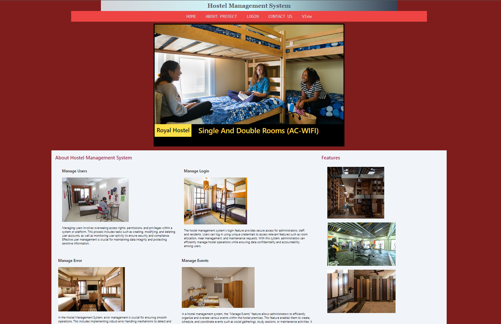

# Hostel Management System

Welcome to the Hostel Management System project! This system aims to streamline the management of student accommodation in a hostel environment. It provides features for room allocation, feedback and complaints, an admin dashboard for monitoring and managing student information and requests, an address page, and a 3D room viewing feature.

## Technologies Used

- **HTML**: Used for structuring the web pages and creating their content.
- **CSS**: Employed for styling the HTML elements, enhancing the visual presentation and layout of the web pages.
- **JavaScript (JS)**: Used to add interactivity and dynamic behavior to the web pages, enhancing user experience.
- **Tailwind CSS**: A utility-first CSS framework utilized for rapidly building custom user interfaces. It offers a set of pre-designed components and utility classes to style the application efficiently.
- **Node.js**: A JavaScript runtime environment that allows running JavaScript code outside a web browser. It is used to build scalable and server-side applications.
- **Express.js**: A minimalist web application framework for Node.js used to build web applications and APIs. It simplifies the process of building robust web servers.
- **MongoDB**: A NoSQL database used for storing data in a flexible, document-based format. It is well-suited for applications with dynamic schemas or those requiring high scalability and performance.
- **Git**: A version control system used for tracking changes in the project codebase, facilitating collaboration among developers, and managing project history.

## Features

### Room Allocation
- Allows administrators to allocate rooms to students.
- Provides a user-friendly interface for selecting and assigning rooms based on various criteria such as availability, preferences, etc.

### Feedback and Complaints
- Enables students to submit feedback and complaints regarding hostel facilities, services, etc.
- Admins can view and address these feedback and complaints through the admin dashboard.

### Admin Dashboard
- Provides administrators with a centralized dashboard to monitor and manage student information.
- Allows admins to view room allocation details, handle feedback and complaints, and manage student requests effectively.

### Address Page
- Displays the address and contact information of the hostel.
- Helps students and visitors to easily find and contact the hostel administration.

### 3D Room Viewing
- Offers a unique feature allowing users to view hostel rooms in a 3D environment.
- Enhances the user experience by providing a visual representation of the hostel rooms before allocation.

## Installation

1. Clone the repository: `git clone https://github.com/yourusername/hostel-management-system.git`
2. Navigate to the project directory: `cd hostel-management-system`
3. Install dependencies: `npm install`
4. Set up MongoDB and configure the connection and write username and admin in Admin collection in HostelMS Database.
5. Run the application: `node localserver.js`
6. Access the application in your browser at `http://localhost:3000`

## Usage

- As an administrator, log in to the admin dashboard to manage student information, room allocation, feedback, and complaints.
- Students can access features such as room allocation, feedback submission, and viewing the hostel address.

## Contributing

Contributions are welcome! If you'd like to contribute to the project, please follow these steps:
1. Fork the repository.
2. Create a new branch: `git checkout -b feature/new-feature`
3. Make your changes and commit them: `git commit -am 'Add new feature'`
4. Push to the branch: `git push origin feature/new-feature`
5. Submit a pull request.

## Contact

For any inquiries or support, please contact on my [email](https://mail.google.com/mail/u/0/#inbox?compose=CllgCJqXxQcxJzrwHJmmfJmbGpBrsQbJKsVBmZVszWBnBqBHkpZhjlqtkMhfkfvdQjZGXlnWztL).

